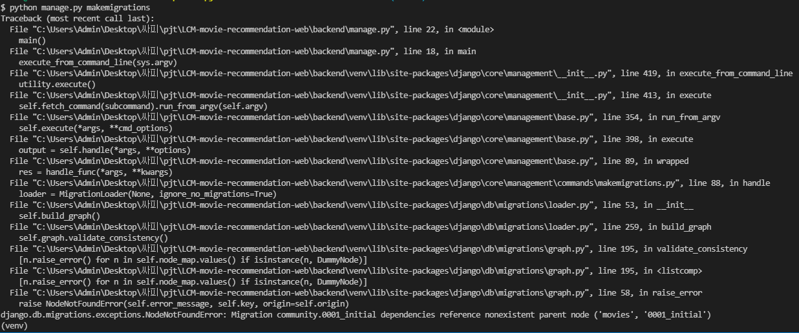
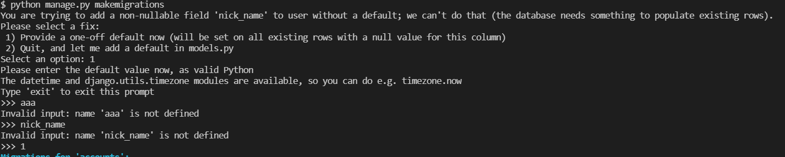

# 📖Final Project

> ## 🔥 목표
>
> - 영화 정보를 제공하는 SPA 제작
> -  AJAX통신과 JSON 구조에 대한 이해
> - Single File Component 구조에 대한 이해 
> - vue-cli, vuex, vue-router등 플러그인 활용
>
> ## 📋 개발일지
>
> >### 1117(Wed)
> >
> >#### 📑  당일 목표
> >
> >* 기본 기능 구현
> >
> >#### 🖍  에러
> >
> >* User모델 확장에서 컬럼이 추가되지 않는 에러
> >* movies APP migrate 후 git merge 과정에서 충돌 발생하는 에러
> >
> >#### ✏  에러해결
> >
> >* ,와 같은 syntax error 수정 완료
> >* migrate 파일 삭제 후 다시 병합 과정을 통해 수정 완료 
> >
> >#### 💡  완료한 기능
> >
> >* 모델링 구현
> >
> >* 회원가입, 로그인 구현
> >* 로그인 상태 확인 
> >* 영화 데이터 받아오기(API)
> >* 영화 데이터 정제
> >* 영화 데이터 전송(Serialize)
> >* 데이터 수신 확인 
> >
> >#### ❗ 논의할 사항
> >
> >* 역할 분담
> >
> >#### 📝 느낀점
> >
> >* 강태훈
> >  * 생각보다 명세서 없이 바닥부터 코드를 쌓아나가고 모델을 설정해 나가는 과정이 어렵다고 느꼈고, 정말 단순한 에러에서도 많은 시간을 쏟는 모습을 보며 아직 실력이 많이 부족하다고 느꼈다.
> >* 우동진
> >  * 평소 pjt를 할 때 명세서 및 기본 코드 등 제공이 되어있던 것들을 없이 하려니깐 생각보다 어려웠고 기본 적인 부분에서 많이 실수를 하는것을 보며 기본기가 역시 중요하구나라는 생각이 들었다.
> >
> >
>
> 
>
> ------
>
> ## 💯개인평가
>
> - 코드의 가독성 : 😊
> - 코드의 창의성 : 😊
> - 스스로 생각한 정도 : 😊
