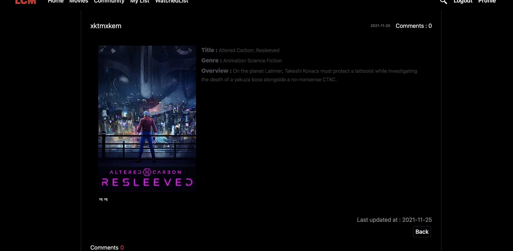

# LCM 프로젝트

* 사용자가 선호하는 장르, 접속 위치의 날씨기반, 봤던 영화 그리고 보고싶은 영화 목록들을 기반으로 영화 추천을 해주는 웹 서비스입니다.


## **🧰 사용기술**

- HTML, CSS, Python, Django, Vue.js


## 📅 프로젝트 기간

- 21.11.17 ~ 21.1126


### 1. 팀원 정보 및 업무 분담 내역

##### 팀장 : 강태훈

* Django를 이용한 서버 로직 구현

* Back-end

##### 팀원 : 우동진

* Vue 클라이언트 구현
* Front-end

=

## ✨ 2. 목표 서비스 및 실제 구현 정도

#### 2-1 목표 서비스

1. 영화 조회 서비스
   - 장르별 영화 조회 (영화 이름순, 개봉일 순 등으로 정렬 가능)
   - 영화 상세 조회
   - Youtube trailer 영상 제공
   - 영화 검색 기능

2. 영화 추천 서비스
   * 유저의 접속 위치에 따른 날씨 기반으로 추천
   * 유저가 회원가입시 선택한 장르 기반 추천
   * 유저가 저장한 나중에 볼 리스트, 봤던영화 리스트 기반으로 추천
   * 유저가 봤던 영상의 길이로 영화 추천
3. Community 기능
   * 영화 리뷰 게시판 운영
   * 댓글 및 평점 기능
4. 유저 정보
   * 소셜 로그인 기능(구글, 네이버)
   * 프로필 이미지 받아오기 


#### 2-2 실제 구현 정도

1. 영화 조회 서비스
   - 장르별 영화 조회 (영화 이름순, 개봉일 순 등으로 정렬 가능)
   - 영화 상세 조회
   - Youtube trailer 영상 제공
   - 영화 검색 기능

2. 영화 추천 서비스
   * 유저의 접속 위치에 따른 날씨 기반으로 추천
   * 유저가 회원가입시 선택한 장르 기반 추천
   * 유저가 저장한 나중에 볼 리스트, 봤던영화 리스트 기반으로 추천
3. Community 기능
   * 영화 리뷰 게시판 운영
   * 댓글 및 평점 기능
4. 유저 정보
   * 소셜 로그인 기능(구글, 네이버)


#### 2-3 데이터베이스 모델링(ERD)


## 3. 프로젝트 진행 과정

#### 3-1. 준비 단계


##### 목표 서비스 설정

* 필요한 기능, 페이지 초안 등에 관해 회의 및 데이터베이스 모델링 하기

  

##### DB만들기

위의 개발 일정대로 진행

프로젝트에서 영화 DB 는 `The Movie DB` 의 사이트에서 API Key를 통해 데이터를 받아 왔습니다.

먼저 아래의 코드를 통해 JSON데이터를 만들어 주었고 이를 `loaddata` 를 통해 `Django` DB에 load했습니다.

```python
import json
import requests
movies = []
genres = [{"id": 28, "name": "Action"}, {"id": 12, "name": "Adventure"}, {"id": 16, "name": "Animation"}, {"id": 35, "name": "Comedy"}, {"id": 80, "name": "Crime"}, {"id": 99, "name": "Documentary"}, {"id": 18, "name": "Drama"}, {"id": 10751, "name": "Family"}, {"id": 14, "name": "Fantasy"}, {"id": 36, "name": "History"}, {
    "id": 27, "name": "Horror"}, {"id": 10402, "name": "Music"}, {"id": 9648, "name": "Mystery"}, {"id": 10749, "name": "Romance"}, {"id": 878, "name": "Science Fiction"}, {"id": 10770, "name": "TV Movie"}, {"id": 53, "name": "Thriller"}, {"id": 10752, "name": "War"}, {"id": 37, "name": "Western"}]

for genre in genres:
    temp = {}
    temp['model'] = 'movies.genre'
    temp['pk'] = genre['id']
    fields = {}
    fields['name'] = genre['name']
    temp['fields'] = fields
    movies.append(temp)


for i in range(1, 20):
    data = requests.get(
        f'https://api.themoviedb.org/3/movie/popular?api_key=245ecc0e095645bb9a67ccf2d25856ec&language=en-US&page={i}').json()
    data_result = data['results']
    for result in data_result:
        temp = {}
        temp['model'] = 'movies.movie'
        field = {}
        movie_field = ['title', 'release_date', 'popularity', 'vote_count',
                       'vote_average', 'overview', 'poster_path', 'genre_ids']

        for key, value in result.items():
            if key in movie_field and key == 'genre_ids':
                field['genres'] = value
            elif key in movie_field and key == 'poster_path':
                field['poster_path'] = f'https://image.tmdb.org/t/p/w500/{value}'
            elif key in movie_field:
                field[key] = value

        temp['fields'] = field
        movies.append(temp)

with open('movies.json', 'w', encoding="UTF-8") as make_file:
    json.dump(movies, make_file, indent='\t')
```


## 4. LCM 웹 페이지의 모든 것

#### 필수 기능 설명

Frontend

* 프론트의 경우 vuex를 통해 전역으로 데이터를 관리하며 유저 정보와 같이 여러 곳에서 필요한 정보는 store에 저장되어서 관리된다.

* 단, 영화 Detail 정보와 같이 단기적으로 필요한 정보의 경우에는 해당 컴포넌트에서 axios요청을 통해 받아오도록 한다.

### 4-1. 웹 서비스 목표

* 유저 맞춤 영화 추천 서비스
* 커뮤니티 기능을 통한 사용자들 간의 의사소통 기능
* UX를 고려한 사용이 쉬운 웹 서비스

### 4-2. 웹 페이지 화면을 통한 기능 설명

#### 1. 로그인

* 기본적인 로그인과 로그아웃은 Simple Jwt를 통한 토큰 기반의 로그인 구현 방식을 따랐다.

* 로그인 API

  * 구글의 경우 신규 사용자의 경우 구글 인증시 바로 구글 이메일을 기반으로 회원가입을 진행시켰다.

  * 네이버의 경우 신규 사용자의 경우 구글 인증시 바로 구글 이메일을 기반으로 회원가입을 진행시켰다.

  * 만약, 두 소셜 로그인 다 구 사용자의 경우 User 모델에서 해당 사용자를 찾아 정보를 반환하고 이를 바탕으로

    로그인을 할 수 있도록 구현하였다.

  * 네이버의 경우에는 개발자 단계일 때는 타 아이디의 접근이 안되는 단점이 있어 이는 추후 배포후에 수정할 예정이다.


#### 2. 회원 가입

* 회원가입에 제한은 없으나 같은 아이디가 들어가면 안되도록 구현하였다.

* 장르를 받아오도록 해 추후 영화 추천에 쓰이도록 했다.


#### 3. 메인 화면

* 로그인 하지 않았을시 나오지 않았던 Navbr 메뉴들이 표시가 되고 다른 페이지로 이동이 가능. Navbar는 사용자가 스크롤을 내려도 고정이되도록 구현.

* 미리 지정한 4개 영화 중 한개의 영화 trailer 영상이 메인 화면에 표시되고 More Info 버튼을 누르면 영상에 나오고 있는 영화의 상세 정보를 확인 가능

* 영화는 마우스 혹은 트랙패드를 좌우로 터치시 영화목록들이 좌우로 움직이도록 구현

* 영상의 아래에 알고리즘들을 기반으로 영화들을 추천을 해줌

  * 해당 지역의 정보를 API를 통해 받아오고 받아온 위도, 경도 데이터를 통해 지역의 날씨를 가져와서 날씨를 바탕으로 영화를 추천하도록 구현

  * 프로필 기반 추천의 경우 해당 유저의 영화 장르를 받아와서 장르를 바탕으로 영화를 조회하고 랜덤으로 해당 장르 영화를 보내도록 구현

  * 장르 기반 추천의 경우 해당 장르에 속한 영화들을 받아와 추천하도록 하였으며, 이때 유저가 선택한 방법에 따라 정렬을 하여 데이터를 보내 줄 수 있도록 구현

  * 유저 리스트 기반 추천의 경우 사용자 리스트에 담긴 영화 목록을 바탕으로 가장 많이 겹치는 장르를 골라와 해당 장르를 바탕으로 영화를 추천 할 수 있도록 구현

* 영화 검색 기능 구현

  * 우선 django orm의 contain_을 이용해 기본적인 검색 기능을 구현하여 영화 제목을 바탕으로 찾아 올 수 있도록 하였다.
  * 만약 한글로 검색해야 하는 경우 우선 네이버 영화 api에 검색어를 바탕으로 요청하여 subtitle을 받아오고 해당 subtitle은 영문으로 되어있어 다시 검색하도록 하였다.
  * 또한 한글 키워드 바탕으로도 검색을 성공하기 위해 네이버 번역 api를 사용하여 해당 키워드를 영어로 번역하고 이를 통해 DB에서 검색하는 방식으로 구현하였다.


#### 4. Movies 페이지

* 영화들을 장르 기준으로 정렬
  * 우측 상단의 Sort 옆에서 개봉일자 순, 이름순, 인기도 순 등의 오름차순, 내림차순 순으로 영화들 정렬 가능


#### 5. 영화 상세 정보

* 영화 포스터를 누르면 Modal 형식으로 영화 상세 정보를 표시
  * 최상단에는 Youtube API를 통해 영화의 트레일러 비디오를 자동재생
  * 아래에 영화의 장르, 평점 정보, 유저의 평점정보(실시간 변경), 총 view, 개봉일자 그리고 줄거리를 표시
  * Write Review를 누르면 해당 영화에 대한 리뷰를 쓸수있는 페이지로 바로 이동
  * Watched와 +를 누르면 각각 봤던 영화 목록 리스트, 볼 영화 목록 리스트에 해당 영화를 추가


#### 6. 커뮤니티 페이지

* 영화의 리뷰를 작성할 수 있는 공간
  * 글의 제목을 누르면 글의 상세정보 페이지로 이동
* 상세 페이지내에서 해당 리뷰에 대한 댓글 추가 및 삭제 가능
* 작성자만 해당 글을 수정 및 삭제 할 수 있도록 코드 구현
* 해당 글, 댓글의 작성시간 및 최종 수정 시간 표시





#### 7. My List & Watched

* 사용자의 편의를 위한 리스트 페이지. Modal창에서 버튼을 누름으로서 실시간으로 추가 및 제거가 가능
* 리스트에 있는 영화들을 기반으로 메인 페이지에서 새로운 영화들 추천


### 8. 반응형 구현(웹, 태블릿사이즈, 휴대폰(iPhone X))

##### 1. 태블릿 사이즈


##### 2. 휴대폰 사이즈


### 5. 프로젝트를 통해 배운 점

#### 1. 배포 준비 과정

* `Heroku` 를 통한 백엔드 서버 배포
  * 배포 준비하는 과정에서 `decouple` 을 사용한 `SECRET_KEY` 및 `API_KEY` 숨기는법
  * heroku에서 postgresql 사용하기 위한 설정 방법
  * `static` 관련 경로 설정 및 정적 파일 관리 및  `collectstatic` 하기
  * `heroku` 에서 key, value값으로 숨긴 키 값들 설정
* `Netlify` 를 통한 프론트엔드 배포 과정 


#### 2. Vue router 데이터 함께 전달

* 커뮤니티에서 제목을 누르면 해당 게시글의 상세 정보로 이동하도록 설정하기 위해 router을 사용
* params를 통해 review.id를 같이 전달

```javascript
// router/index.js
{
    path:'/community/:reviewId',
    name:'ReviewDetail',
    component: ReviewDetail,
    props:true,
  },
    
// ReviewList.vue
detail: function (review) {
      this.$router.push({
        name: "ReviewDetail",
        params: {
          reviewId: review.id,
        },
      });
    },
```


### 6. 느낀점

끝 없는 버그의 연속. 조금더 체계적으로 코드를 짰더라면 어떨까라는 생각이 든다. 처음에는 장고와 뷰를 왔다갔다하면서 작업을 하였고, 이후에는 Vue 부분을 집중적으로 작업을 하였다. 처음에 서로 한곳을 정하지 못하고 이쪽저쪽 왔다갔다한게 영향을 주기는 했겠지만, 그 이후에도 제한 기간내에 목표했던 기능들을 완성하는데만 몰두한 나머지 코드를 체계적이고 효율적으로 구현하지 못했다. 다음 프로젝트부터는 코드 작성전에 설계에 시간을 조금더 할애를 해야할 필요성을 느꼈다. 좀 더 깔끔하고 체계적으로 코드를 짤 수 있었는데라는 아쉬움이 든다. 반면에 시작하기전 목표로 했던 기능들을 거의 다 구현을 다 한것에 있어서 만족을 한다.  하지만 배포를 하니 분명 똑같은데 local에서는 잘 작동이 되는부분이 배포 서버에서는 이상하게 작동을 하고 버그가 생기는 등 많은 이슈들이 생겼다. 아직도 이 부분은 정말 이해가 가지 않는다. 슬라이싱을 통해 영화들을 지정해줬는데 그 리스트 중에 없는 영화 정보가 뜨는 등... Vue나 Django 등 프레임워크나 개발 언어들도 중요하지만 Web 그리고 DOM 및 네트워크 등에 대한 공부의 필요성도 느끼게 해준 프로젝트였다. html 구조나 CSS도 처음부터 구축을 하며 많이 배울 수 있었던 좋은 기회였고, 팀원과 협업을 하며 배포까지 끝내며 웹의 전체 과정을  알 수 있었던 프로젝트였다.
